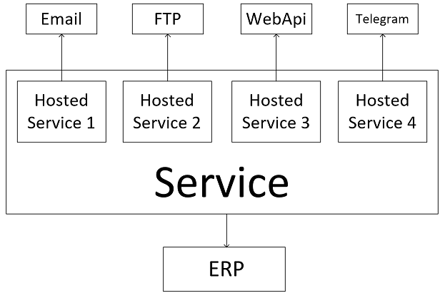
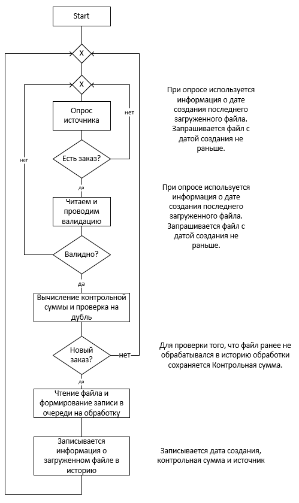

# WestEast_TestTask
Тестовое задание для Web C# .Net Developer
С текстом задания можно ознакомиться [тут](https://docs.google.com/document/d/14XGefbJ4kz1zOOfkfwIqoi1RxgdBH7K2LgrINOTKq2Q/edit#heading=h.gjdgxs)

## Описание архитектуры реализации задания:
В основе лежит 4 реализации класса "Лоадера" для каждого из источников (email, FTP, web API, Telegram) свой.
Каждый из лоадеров содержит набор парсеров для разных форматов загруженных файлов.
Под каждый из лоадеров запускается отдельный HostedService.

Работа парсеров реализована при помощи паттерна "Chain of responsibility", цепь собирается за счет инжекции всех классов реализующих интерфейс IOrderParser. Для добавления нового парсера будет достаточно просто добавить еще один класс и реализовать в нем этот интерфейс.

Блок схема сервиса:

Блок-схема работы Лоадера:

Для реализации был выбран источник "web API клиента". 
Так же было реализовано два теста:
1. Проверяет корректность загрузки файла, правильность вызова метода сохранения загруженной информации и вызов метода передаци заказа на дальнейшую обработку.
2. Проверяет, что Лоадер не отдает в обработку уже загруженные файлы.

